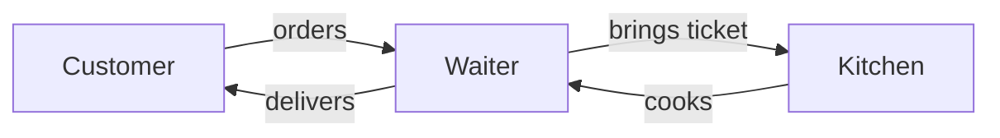
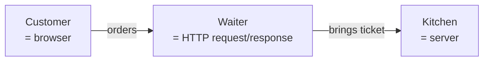

# Authoring lessons for this course

Working playbook for anyone — human or AI agent — writing or editing a lesson. Distilled from the Phase 1 build + the UAT walkthrough that surfaced what the original close missed. If you only have time to read one document before authoring a lesson, this is it.

For the locked rules (do-not-violate), see `CLAUDE.md` at the repo root.
For the contributor-facing summary (PR etiquette, what we want), see `CONTRIBUTING.md`.

---

## Part 1 — The pedagogical contract

### Audience floor (the one assumption that shapes everything)

A learner arriving at Module 0:
- Has used a computer (browser, email, files).
- May have viewed a page on github.com but never edited one.
- Has never written production code.
- Has not heard the words `HTTP`, `DNS`, `schema`, `SQL`, `JWT`, `RLS`, `localhost`, `CI/CD`, `magic link`, `NEXT_PUBLIC`, or `RLS` in a technical sense — and is not expected to.

Every technical noun in lesson prose must pass one of three tests:
1. **Safe at this module** per `docs/audience-vocabulary.md` → use freely.
2. **Requires-callout at this module** → first use must carry a D-04 vocab callout: `**term** (one-line definition, [→ GLOSSARY](../../GLOSSARY.md#anchor))`. Subsequent uses in the same lesson can drop the callout.
3. **Forbidden at this module** → don't use it. Defer to the module that introduces it. If the concept is unavoidable, use an analogy or write `"you'll meet this in Module N"`.

The contract is **incremental** — a term that's Safe in M0 is also Safe in M1+. A term that's Requires-callout in M0 becomes Safe in M1+ (the learner already met it). Don't redefine terms that are already established.

### Locked analogies (D-07)

The analogies in Module 1 are not creative territory. They were chosen for cross-cultural recognizability and consistency, and lessons in later modules will reference them back.

| Bundle | Analogy nouns |
|--------|---------------|
| 1 — How the web works | restaurant / customer / waiter / kitchen / dish / ticket / side dish |
| 2 — Where data lives | filing cabinet / drawer / index card / receptionist / clerk / form / paper / inter-office mail |
| 3 — Who can do what (authentication, authorization) | door staff / ID / VIP list / hand stamp / private backroom |
| 4 — How it goes live (deployment) | private kitchen / recipe binder / prep cooks / public restaurant / opening night |

When you write a Mermaid diagram in the **simple form**, you may use ONLY these nouns plus generic verbs (orders, brings, delivers, hands over). No `=` annotations. No HTTP / SQL / schema / CI/CD shorthand. No hybrid labels like `Build server = prep cooks`.

If a new lesson needs an analogy that isn't on this list, propose it in the phase's PLAN.md before writing the lesson body. Don't improvise.

### Voice contract (LESSON-12)

Two things to avoid:

1. **Tutorial fiction** — language that paints over the friction a learner will actually encounter. Examples:
   - "in just a few clicks" (reality: ten steps, three of them counterintuitive)
   - "now you can simply" (reality: still complex)
   - "as simple as that" (reality: not)
   - "just like that" (same)
2. **Filler** — words that don't carry information. Examples:
   - "in today's fast-paced world"
   - "in this day and age"
   - "with the increasing need for"

If you catch yourself writing one of these, rewrite. `scripts/voice-lint.sh` will catch them too, but the right move is not writing them in the first place.

---

## Part 2 — The nine-element lesson anatomy

Every lesson uses `lesson-template.md` (or `lesson-template-m0.md` for Module 0). The nine elements, in order:

1. **Objective** (LESSON-01) — one sentence: "By the end of this lesson, you'll be able to ___." Concrete and observable, not aspirational.
2. **Why this matters** (LESSON-02) — 2-4 sentences linking the lesson to the learner's actual goal (shipping a deployed app).
3. **Core read** (LESSON-03, 600-1500 words) — the main teaching. Prose first; analogies first; diagrams as visual aids, not as the load-bearing teaching mechanism.
4. **Vocab callouts** (LESSON-04, D-04 pattern) — defined inline using `**term** (one-line definition, [→ GLOSSARY](../../GLOSSARY.md#anchor))`.
5. **Exercise** (LESSON-05, 10-25 minutes) — concrete, deliverable-shaped, names whether paper / excalidraw / code is acceptable.
6. **Checkpoint** (LESSON-06) — "You've got this if you can ___." One or two testable claims.
7. **Going deeper** (LESSON-07) — optional pointers. If the lesson has none, declare via front-matter `deviations: [no-going-deeper]` AND remove the section.
8. **Loop check** (LESSON-09) — one sentence connecting the lesson to one of the durable AI-coding loop steps (intent / ask / evaluate / steer). **In Module 1 (pre-loop), every Loop check names `intent`** (D-05).
9. **What you just did** (LESSON-10) — 2-4 sentences recapping the exercise and linking it back to the loop.

Plus the front-matter (title, module, lesson_number, est_minutes, deviations, GLOSSARY anchors used) and navigation (prev/next links per OPS-05).

If you skip or shorten an anatomy element, add it to the front-matter `deviations:` array AND drop a `> **Deviation note:**` blockquote near the affected section explaining why.

---

## Part 3 — Diagrams in M1+

This is where Phase 1's UAT walkthrough surfaced the most subtle pedagogy bugs. Read this section carefully before adding or editing a Mermaid block.

### The simple-first / bridge-collapsed convention

For every M1+ lesson that uses Mermaid to teach a spatial or relational concept:

1. **The simple-form Mermaid comes first**, in plain view in the lesson body. It uses ONLY the locked D-07 analogy nouns. No technical labels.
2. **The technical Mermaid comes second**, wrapped in a `<details><summary>` HTML5 disclosure widget. It uses the real names (HTTP, SQL, schema, CI/CD, etc.). The summary line names which later module covers those terms hands-on.
3. **Inside the disclosure**, before the technical Mermaid, a `> *Peek ahead — skim, don't memorize:*` blockquote callout carries the analogy → real-term mapping with the technical terms in bold.

**Why both diagrams cannot just sit side-by-side:** a learner who sees the technical diagram in their peripheral vision feels obligated to absorb the labels. Those labels are exactly the M3-M5 vocabulary M1 is designed to defer. Optionality has to be a real visual affordance, not just framing in the surrounding prose.

### Worked example (the canonical pattern)

````markdown
So the round trip looks like this:



<details>
<summary>Optional: same picture with the technical labels (Module 3 hands-on)</summary>

> *Peek ahead — skim, don't memorize:* The same picture with the real names labeled. You'll meet **HTTP**, **request**, **response**, **server**, and **browser** properly in Module 3, where you'll write your first API route by hand. If the labeled diagram feels heavy, close this and move on.



</details>

The order ticket has a specific shape. ...
````

### GFM blank-line discipline (MANDATORY)

GitHub-Flavored Markdown parses fenced code blocks inside `<details>` correctly ONLY when blank lines surround them. If any of these four blank lines is missing, the Mermaid inside the disclosure will NOT render — GFM will treat the body as raw HTML.

```
<details>
<summary>Summary text</summary>
                              ← BLANK LINE (after </summary>)
> *Peek ahead callout...*
                              ← BLANK LINE (before ```mermaid)
```mermaid
... diagram ...
```
                              ← BLANK LINE (after closing ```)
</details>
```

**Verifying:** view the file's preview on github.com after pushing. If the disclosure expands but the Mermaid doesn't render, count blank lines.

### The Mermaid `<br/>` rule (subtle and asymmetric)

GitHub's Mermaid parser has different rules for HTML break tags depending on where they appear:

| Context | `<br/>` works? | `<br>` works? | Right answer |
|---------|---------------|---------------|--------------|
| Flowchart node label `["Node<br/>=label"]` (QUOTED) | ✓ | ✓ | Use `<br/>` (matches existing convention) |
| Flowchart node label `Node[Node<br/>=label]` (UNQUOTED) | ✗ | ✗ | Quote it: `Node["Node<br/>= label"]` |
| Flowchart edge label `-->|text<br/>more|` | ✗ | ✗ | Write as single line: `-->|text more|` |
| SequenceDiagram Note `Note over X: text<br/>more` | ✗ | ✗ | Single line: `Note over X: text — more` |
| SequenceDiagram message `A->>B: text<br/>more` | ✗ | ✗ | Single line: `A->>B: text — more` |

`scripts/voice-lint.sh` check #7 enforces this. The check strips `["..."]` quoted regions inside Mermaid fences and then flags any remaining `<br/?>` as a render-breaker. Fixture: `scripts/voice-lint-fixtures/07-mermaid-br-outside-quotes.md`.

### The "Module N hands-on" pointer

When the technical Mermaid introduces M3+ vocabulary, the disclosure summary line and the peek-ahead callout both name which later module the learner will use those terms hands-on. The current mapping:

| Bundle | Technical terms introduced | Hands-on module |
|--------|---------------------------|-----------------|
| 1 (how-the-web-works) | HTTP, request, response, server, browser-as-program, HTML, GET/POST/PUT/DELETE, status codes | Module 3 (single-user vertical slice) |
| 2 (where-data-lives) | table, row, foreign key, schema, API, HTTP request, SQL, database | Module 3 |
| 3 (who-can-do-what) | authentication, authorization, session token, cookie, sign-in | Module 4 (multi-user social graph) |
| 4 (how-it-goes-live) | localhost, build server, public URL, CI/CD, git push | Module 5 (operating the build) |

Map terms to the module where the learner **does** them hands-on, not the phase where they're first mentioned in passing.

### M0 stays diagram-light

Module 0 lessons (welcome, hardware check, cost-path triage, account creation, Codespaces walkthrough) deliberately do not use Mermaid. They're setup-task lessons, not mental-model lessons. LESSON-11 mandates Mermaid for spatial/relational concepts, which is M1+ territory.

### M2+ uses the disclosure pattern selectively

By Module 2 the learner has met the M3 vocabulary at least once (via the M1 peek-aheads). Use the disclosure pattern in M2+ only when introducing a genuinely new concept whose terminology hasn't been taught yet.

---

## Part 4 — The voice-lint contract

`scripts/voice-lint.sh` is the programmatic gate. It has seven checks; understand each before writing or editing lessons.

| # | Check | What trips it | Fixture |
|---|-------|---------------|---------|
| 1 | Tutorial fiction | `in just a few clicks`, `now you can simply`, etc. | `01-tutorial-fiction.md` |
| 2 | Filler | `in today's fast-paced world`, etc. | `02-filler.md` |
| 3 | GH admonitions | `> [!NOTE]`, `> [!WARNING]`, etc. | `03-github-admonition.md` |
| 4 | Unresolved GLOSSARY anchor | A `[→ GLOSSARY](../../GLOSSARY.md#anchor)` link whose anchor has no matching `### anchor` line in GLOSSARY.md | `04-missing-glossary-anchor.md` |
| 5 | Broken relative path | A link from `modules/**/*.md` to a root cross-cutting doc (GLOSSARY, BUDGET, …) whose relative path doesn't resolve | `05-broken-glossary-relative-path.md` |
| 6 | Jargon-density (audience-vocabulary) | A Forbidden term used bare; or a Requires-callout term used without a D-04 callout in the same lesson | `06-jargon-density.md` |
| 7 | Mermaid `<br>` outside quoted node labels | Any `<br>` or `<br/>` inside a ` ```mermaid ` fence that isn't inside `["..."]` quoting | `07-mermaid-br-outside-quotes.md` |

### How the jargon-density check actually scopes

Check #6 is the most nuanced. Before scanning for bare Forbidden terms, the check **strips** the following from a working copy of the lesson:

- Fenced code blocks ` ``` … ``` `
- Inline code spans `` `...` ``
- Markdown URL destinations `(...)` parts of `[text](dest)`
- Markdown image destinations
- D-04 callout definition clauses (the entire `**term** (...)` span including its trailing parenthetical)
- Lines beginning with `> ` (blockquotes — including peek-ahead callouts, deviation notes, bridge text inside disclosures)
- YAML frontmatter

Plus per-module compound stripping:

- Any occurrence of a Requires-callout compound term containing the Forbidden term (e.g., `API key` is M0 Requires-callout → strip `API key` before checking bare `API`).
- Brand-prefixed compounds: `[A-Z][a-z]+ <Forbidden>` (e.g., `Anthropic API`, `Gemini API`, `Google API`).
- Small allowlist of M0 known-compounds: `T credit`, `T credits`, `T path`, `T paths` (e.g., `API credit`).

After stripping, any remaining bare `\b<Forbidden>\b` triggers a violation. Strict acronyms (API, HTTP, DNS, SQL, JWT, RLS, CI/CD) are matched case-sensitively to allow lowercase prose use of words like "api" inside slugs/URLs.

### WARN vs VIOLATION

Check #6 emits both:
- **WARN** lines for callout-missing cases (a Requires-callout term used without a callout) and bare Forbidden cases — these document the editorial backlog but do NOT block the gate.
- **VIOLATION** lines would block — currently no VIOLATIONS are emitted from #6 by default (the WARN-only behavior is documented in `01-8-SUMMARY.md` as a deliberate choice to ship the lint without retroactively blocking on every legacy phrasing).

Checks #1–#5 and #7 always emit VIOLATIONS (no WARN tier).

**Exit code 0 is the gate.** Default scan with ~50 WARNs still exits 0.

### Self-test mode

`./scripts/voice-lint.sh --self-test` runs every check against fixtures in `scripts/voice-lint-fixtures/` and asserts each fixture trips the check it targets. Run this whenever you modify `scripts/voice-lint.sh` itself or any fixture.

---

## Part 5 — Authoring workflow checklist

Before opening a PR with a new or modified lesson:

1. **Read** `docs/audience-vocabulary.md` for the target module. Identify which Requires-callout terms you need + which Forbidden terms you must avoid.
2. **Write** the lesson body. Use D-04 callouts on first use of every Requires-callout term. Use the locked analogy. Stay inside the nine-element anatomy.
3. **Add diagrams** (M1+) using the simple-first / bridge-collapsed convention. Verify the GFM blank-line discipline. Use the right module-pointer in the disclosure summary.
4. **Add anchors** for any new vocab to `GLOSSARY.md` (`### anchor-name` headers).
5. **Update** `docs/audience-vocabulary.md` if you introduced a new technical noun. Classify it as Safe / Requires-callout / Forbidden for the relevant modules.
6. **Run** `./scripts/voice-lint.sh`. Read every VIOLATION line and fix.
7. **Run** `./scripts/voice-lint.sh --self-test` if you touched the lint or fixtures.
8. **Preview** on github.com after pushing. Look specifically at:
   - Mermaid renders (both simple and technical when the disclosure is expanded)
   - GLOSSARY links resolve when clicked
   - Prev/next nav at the bottom of the lesson works
9. **WHAT-CHANGED.md** — add a dated entry if the change shifts a lesson's content meaningfully (new lesson, new analogy, changed bundle, contract update).
10. **Commit** with the conventional commit shape (`feat(NN-M):`, `fix(NN):`, `docs(NN):`).

---

## Part 6 — Common authoring traps (and how to dodge them)

### Trap: "I'll just use the technical word once"

You won't. The temptation to drop in `HTTP` or `database` or `git push` without a callout — especially when it feels obvious to you — is the bug that produced 01-HUMAN-UAT.md Test 2. Defer to the analogy. If you genuinely need the technical word, give it a D-04 callout and verify it's Requires-callout (not Forbidden) for this module.

### Trap: "The analogy doesn't quite fit, let me invent one"

D-07 is locked. The four bundles' analogies are reused in later modules; inventing a new one breaks downstream lessons. If you need a new analogy, propose it in the phase's PLAN.md and get the user's sign-off.

### Trap: "I'll show both diagrams together so the learner can compare"

This was the original 01-7 design and it failed UAT (the technical labels still landed in the learner's head). The disclosure is load-bearing. Don't undo it.

### Trap: "Mermaid inside `<details>` is too fragile, I'll just put the technical version in a `## Going deeper` section"

That separates the analogy from the bridge content visually. Learners who DO want the bridge no longer get it side-by-side. The disclosure pattern is the compromise: visible cue + click-to-reveal. Use it.

### Trap: "The lint flagged 'API' in `Anthropic API`, the lint is broken"

It isn't. The brand-prefix stripping rule in check #6 explicitly handles `Anthropic API`, `Gemini API`, `Google API`. If you see a violation on `Foo API`, check that `Foo` starts with a capital letter and is followed by exactly one space and `API`. If you legitimately need to use `API` bare (e.g., the M3 lesson that introduces the concept), update `docs/audience-vocabulary.md` to move `API` out of M3's Forbidden list when M3 ships.

### Trap: "I should fix all the WARNs"

You can, and you should over time — but a single PR closing 50 WARNs across all M0+M1 lessons is too big to review. Pick a lesson, close its WARNs, ship that PR. Iterate.

### Trap: "I'll commit the SUMMARY.md too"

`.planning/` is gitignored. Anything you write under `.planning/` will not appear in git status or get committed. That's intentional — plans and summaries are project internal, not part of the shipping artifact. Don't add `.planning/` to `.gitignore` exceptions; don't move plans into the tracked tree.

### Trap: "I'll use `> [!NOTE]` because GitHub renders it nicely"

It does, on github.com. But the course will also render on Next.js (Phase 01.1) where bracketed admonitions don't render at all — you'd see `> [!NOTE]` as literal text. `> **Note:**` works everywhere. Check #3 of the lint catches this.

### Trap: "I'll skip the GLOSSARY anchor; it's just a definition"

The GLOSSARY anchor is the contract that ensures every term defined in a lesson exists in the project-wide vocabulary index. Without it, future lessons can use the term assuming it's been defined; without a stable GLOSSARY entry the cross-lesson contract breaks. Check #4 of the lint catches missing anchors; check #5 catches broken relative paths to the anchor.

---

## Part 7 — When you're changing the contract itself

If you need to:
- Add a new term to `docs/audience-vocabulary.md` → straightforward; just edit and commit.
- Move a term across categories (Safe ↔ Requires-callout ↔ Forbidden) → bigger; affects every lesson that uses the term. Run the lint after to surface affected lessons.
- Change the disclosure pattern → requires updating all M1 lessons + `lesson-template.md`. Ask the user.
- Change a locked analogy (D-07) → requires updating the bundle's lesson + all downstream lessons that reference it + `01-CONTEXT.md` D-06/D-07 entries. Ask the user.
- Add a new lint check → fixture in `scripts/voice-lint-fixtures/`, scan function in `voice-lint.sh`, self-test assertion. See Plan 01-8's pattern for shape.

Contract changes propagate. Always ask before changing locked decisions; always update `WHAT-CHANGED.md` when you do.

---

## Part 8 — When you're an AI agent specifically

A few things that catch agents more than humans:

1. **Don't make up GLOSSARY anchors.** Check what exists before writing a callout. Use the existing anchor if the term is already defined (e.g., reuse `### github` rather than introducing `### github-the-website`).
2. **Don't deliberate forever on edge cases.** Plan 01-8's first attempt stalled at 600s trying to figure out whether "Anthropic API" should count as a bare use of `API`. The orchestrator unblocked the retry by pre-deciding the rule. If you find yourself debating a third edge case while authoring a lint or a lesson, ship the pragmatic version + document the limitation, then move on.
3. **Don't commit `.planning/` files.** Even if Write succeeds, git won't track them. Don't waste a tool call trying.
4. **Don't try to fix WARN lines as part of a lesson PR.** They're the editorial backlog; closing them is its own focused work.
5. **Read this file fully** before writing your first lesson. The patterns are subtle and the wrong solutions are easy to invent (the side-by-side render that didn't work; the `<br/>` → `<br>` retry that didn't fix it; the lint that almost over-blocked on `Anthropic API`).

If you change a load-bearing rule, update this file too. Future agents inherit only what's written down.
