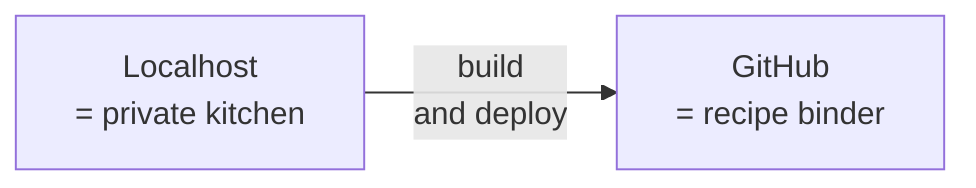

# Mermaid `<br>` outside quoted node labels — fixture

This fixture trips the `scan_mermaid_br` check by placing `<br>` and `<br/>` in
sequenceDiagram Notes, sequenceDiagram messages, and flowchart edge labels —
the three contexts GitHub's Mermaid parser rejects. A quoted node label with
`<br/>` is also included; the lint must NOT flag that one (it's the safe form
established in commit `6ce66f7`).

```mermaid
sequenceDiagram
  participant A
  participant B
  Note over A: dish has parts; customer<br>asks waiter for each
  A->>B: hands over a form:<br/>"what posts has Alice written?"
```



Expected violations: at least 3 — one Note, one message, one edge label.
Expected NOT to be flagged: the `["Localhost<br/>= private kitchen"]` and
`["GitHub<br/>= recipe binder"]` quoted node labels.
